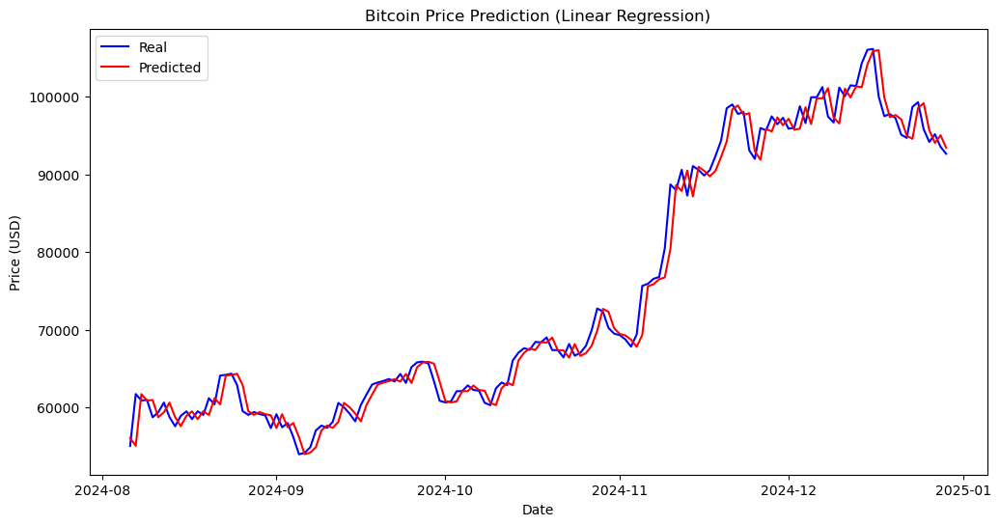
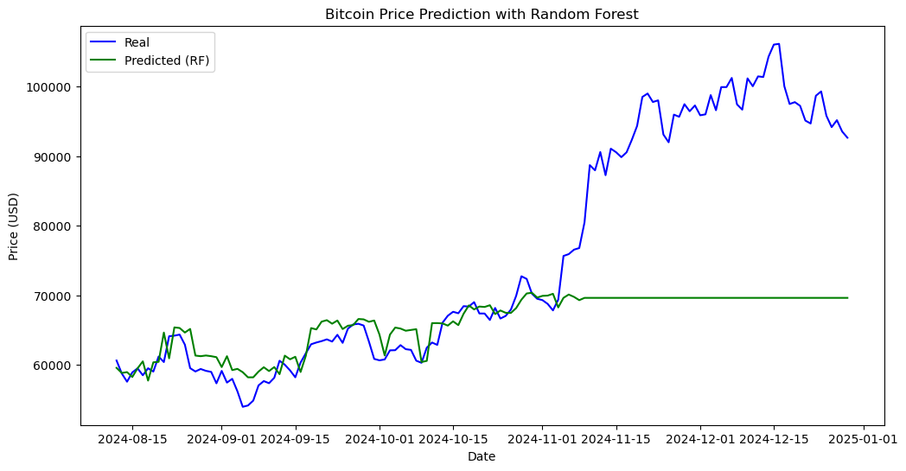

# Cryptocurrency Price Prediction using Machine Learning

### Overview
This project aims to predict the prices of the top 10 cryptocurrencies for the year 2025 using historical price data and related news sentiment from 2023–2024. It includes steps from data collection and cleaning to exploratory data analysis (EDA), sentiment analysis, and machine learning model training.

### Project Objective

> 🔹 Collect historical cryptocurrency price and news data.  
> 🔹 Clean & explore the dataset (EDA).  
> 🔹 Train ML models to predict future prices.  
> 🔹 Visualize predictions and evaluate performance.

Content of `requirements.txt`:
```
pandas
yfinance
matplotlib
seaborn
scikit-learn
numpy
requests
```

### Installation

1. Clone the repository:
```bash
git clone https://github.com/sadyrll/crypto-price-prediction.git
cd crypto-price-prediction
```

### Data Sources

- **Prices**: Collected via [`yfinance`](https://github.com/ranaroussi/yfinance)
- **News Titles**: Collected from [`CryptoPanic`](https://cryptopanic.com/developers/api/) or `NewsAPI`

Tracked cryptocurrencies:
- Bitcoin (BTC), Ethereum (ETH), Solana (SOL), Avalanche (AVAX),
- Polkadot (DOT), Litecoin (LTC), Chainlink (LINK),
- Binance Coin (BNB), Ripple (XRP), Cardano (ADA)

---

### 📈 Models Implemented

| Model               | Features Used                   | MSE (Test)     |
|--------------------|----------------------------------|----------------|
| Linear Regression  | Price, SMA (30 days)             | ~4000–5000     |
| Random Forest      | Price, SMA (30 days)             | ~3000–4000     |

Prediction Visuals:

<div align="center">
	
</div>

_Linear Regression with SMA feature on Bitcoin_

<div align="center">
	
</div>

_Random Forest prediction on Bitcoin_

---
### Authors
- Sadyr Aida
- Musina Anel
